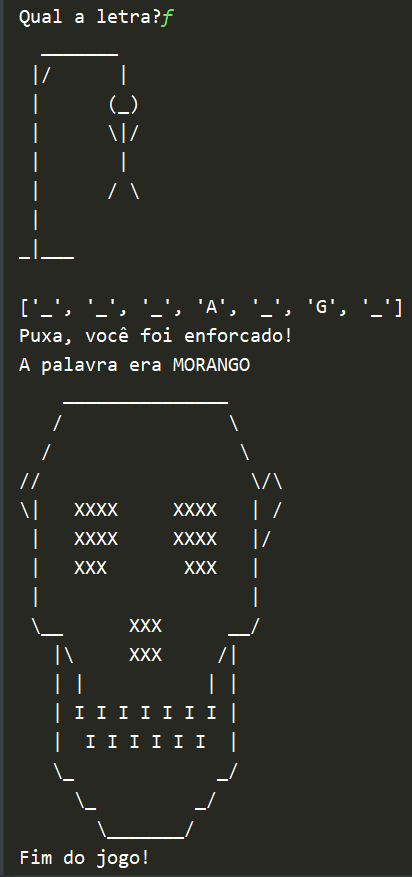

<h1 align="center"> :snake: Python 3 :snake: </h1>

# :mag: Índice
- [:mag: Índice](#mag-índice)
  - [:clipboard: Sobre](#clipboard-sobre)
  - [:rocket: Tecnologia](#rocket-tecnologia)
  - [:camera:Screenshots](#camerascreenshots)
    - [Menu dos jogos](#menu-dos-jogos)
    - [Forca](#forca)
    - [Adivinhação](#adivinhação)

---
## :clipboard: Sobre

O projeto foi criado dentro dos cursos **"<a href="https://cursos.alura.com.br/course/python-introducao-a-linguagem">Python: começando com a linguagem</a>"** e **"<a href="https://cursos.alura.com.br/course/python-3-avancando-na-linguagem">Python: avançando na linguagem</a>"**  com o intuito de colocar em prática todo o conteúdo estudado durante os cursos.

---
## :rocket: Tecnologia

O projeto foi desenvolvido utilizando a seguinte tecnologia

- [Python 3 → v3.8.1](https://www.python.org/)

---

## :camera:Screenshots

### Menu dos jogos

### Forca
Ganhando o jogo

Perdendo o jogo

### Adivinhação
